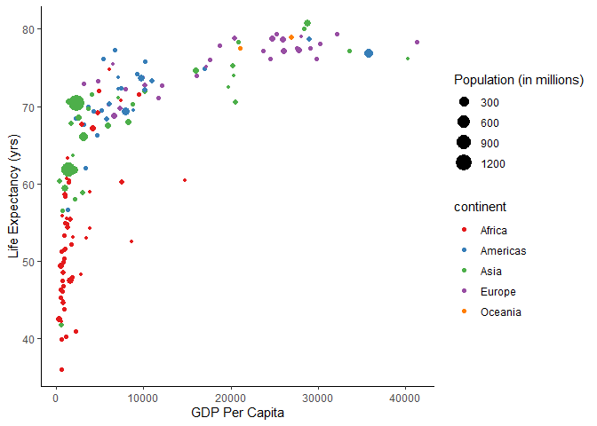

``` r
library(tidyverse)
```

    ## ── Attaching packages ─────────────────────────────────────── tidyverse 1.3.2 ──
    ## ✔ ggplot2 3.4.0     ✔ purrr   0.3.4
    ## ✔ tibble  3.1.8     ✔ dplyr   1.0.9
    ## ✔ tidyr   1.2.0     ✔ stringr 1.5.0
    ## ✔ readr   2.1.2     ✔ forcats 0.5.2
    ## ── Conflicts ────────────────────────────────────────── tidyverse_conflicts() ──
    ## ✖ dplyr::filter() masks stats::filter()
    ## ✖ dplyr::lag()    masks stats::lag()

This report was prepared to the attention of the United Nations. It
analyzes the relationship between a country’s GDP, its life expectancy
and CO2 emissions. Our goal is to determine to what degree a country’s
economic strength or weakness may be related to its public health status
and impact on climate pollution. We hypothesize that both life
expectancy and CO2 emissions increase with a country’s GDP.

``` r
gapminder_1997 <- read_csv("data/gapminder_1997.csv")
```

    ## Rows: 142 Columns: 5
    ## ── Column specification ────────────────────────────────────────────────────────
    ## Delimiter: ","
    ## chr (2): country, continent
    ## dbl (3): pop, lifeExp, gdpPercap
    ## 
    ## ℹ Use `spec()` to retrieve the full column specification for this data.
    ## ℹ Specify the column types or set `show_col_types = FALSE` to quiet this message.

``` r
# make plot of GDP (x axis) vs LifeExp (y-axis)
ggplot(data=gapminder_1997)+
  aes(x = gdpPercap, y = lifeExp, color = continent, size=pop/1000000)+
  geom_point()+
  labs(x = "GDP Per Capita", y = "Life Expectancy (yrs)", size = "Population (in millions)")+
  scale_color_brewer(palette = "Set1")+
  theme_classic()
```


